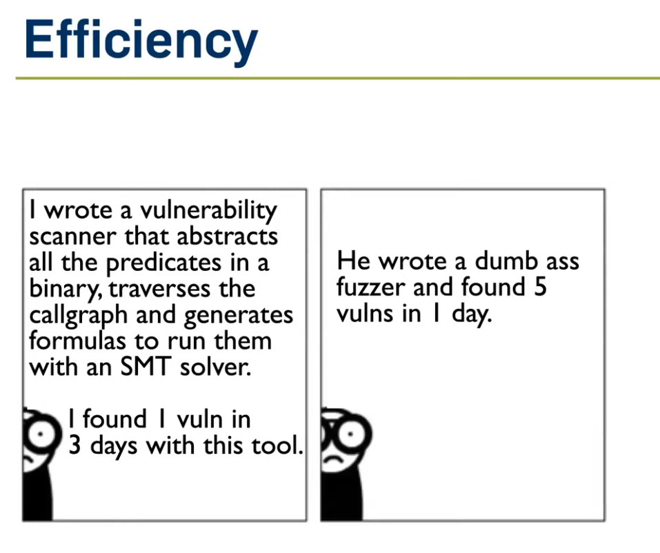

# Nvidia Corpus Generator

**Nvidia Corpus Generator** is a tool designed to generate sample escape codes, which can be used as starting corpora with your favorite fuzzer. For any background information on what is a display driver and how to interact with it, please look at [Fuzzing Nvidia Drivers](https://2022.hexacon.fr/slides/fuzzing_NVIDIA_drivers-tdore.pdf) and their respective talk on [Youtube](https://www.youtube.com/watch?v=ffBuY7ON57g).

## Purpose

While fuzzing Nvidia's driver for vulnerabilities, I came across this paper: [Fuzzing Nvidia Drivers](https://2022.hexacon.fr/slides/fuzzing_NVIDIA_drivers-tdore.pdf), where the researcher used Triton to symbolically execute files and solve constraints to build their corpus library. With limited time, I wanted to create something that would achieve 60% of the results with 20% of the effort.



I started by reversing the `nvlddmkm.sys` driver and replayed numerous collected escape codes with their respective structures to see the outcomes. Very quickly, I noticed that every single escape code sent to the driver ended up in the same place. Even minor alterations to the data buffer's size would return an error. This led me to realize that the software likely maintains its own structure to know what to expect when certain escape codes are received.

Long story short, I ended at this code block

```c
           originalEscapeCode = pPrivateData[4];
            if ( (originalEscapeCode & 0xF0FFF000) != 0 )// escape code is in a format 0X000XXX where 0s are required to be 0
            {
              resultCode = -9;
              _mm_lfence();
              sub_C23A0(3i64, (unsigned int *)0x38D5D740, 0x9540000u);
            }
            else if ( (originalEscapeCode & 0xFFF) != 0 )
            {
              InputConfigs = &escapeConfigRecord;
              EscapeCodeUpperbit = HIBYTE(originalEscapeCode) & 0xF;
              while ( *InputConfigs != EscapeCodeUpperbit )// only the last byte is used to check
              {
                ++v14;
                InputConfigs += 6;              // +0x18
                if ( v14 >= 0xD )
                {
                  resultCode = 0xFFFFFFF9;      // cannot find upperbit
                  v19 = 0x9791000;
LABEL_51:
                  _mm_lfence();
                  sub_C23A0(3i64, (unsigned int *)0x38D5D740, v19, (unsigned int)pPrivateData[4]);
                  return resultCode;
                }
              }
              if ( *(_WORD *)(*((_QWORD *)InputConfigs + 2) + 0x10i64) != 0x10 )
                FastBail();
              expectedTag = InputConfigs[1];
              if ( expectedTag == *ourPacketTag || expectedTag == 'NV**' || *ourPacketTag == 'NV**' )// check magic tag
              {
                foundEscapeRecord = *((_QWORD *)InputConfigs + 2);
                do
                {
                  curEscapeCode = *(_DWORD *)(foundEscapeRecord + 0x38);
                  foundEscapeRecord += 0x38i64;
                  if ( curEscapeCode == -1 )
                    goto LABEL_50;
                }
                while ( curEscapeCode != pPrivateData[4] );// inputCode check
                if ( !foundEscapeRecord )
                {
LABEL_50:
                  resultCode = 0xFFFFFFF6;
                  v19 = 0x9D21000;
                  goto LABEL_51;
                }
```

Within Nvidia's `.rdata` section, there exists a structure that holds the details of every possible escape code, along with their handler and sanity check function. It looks like this:

```asm
.rdata:0000000000D03F98 01 00 00 00                   escapeConfigRecord dd 1                 ; DATA XREF: VerifyEscapeData+17A↓o
.rdata:0000000000D03F9C 2A 2A 56 4E                   aVn             db '**VN'               ; DATA XREF: VerifyEscapeData+EE↓o
.rdata:0000000000D03FA0 F0 63 5B 01 00 00 00 00                       dq offset handle_1xxxxxxx
.rdata:0000000000D03FA8 C0 D8 6C 01 00 00 00 00                       dq offset EscapecodeSanityTable_1
.rdata:0000000000D03FB0 02 00 00 00                                   dd 2
.rdata:0000000000D03FB4 58 44 56 4E                   aXdvn           db 'XDVN'
.rdata:0000000000D03FB8 F0 50 5B 01 00 00 00 00                       dq offset handle_2xxxxxxx
.rdata:0000000000D03FC0 90 1C 6D 01 00 00 00 00                       dq offset EscapecodeSanityTable_2
.rdata:0000000000D03FC8 03 00 00 00                                   dd 3
.rdata:0000000000D03FCC 4C 47 56 4E                   aLgvn           db 'LGVN'
.rdata:0000000000D03FD0 00 00 00 00 00 00 00 00                       dq 0
.rdata:0000000000D03FD8 80 5F 6D 01 00 00 00 00                       dq offset EscapecodeSanityTable_3
.rdata:0000000000D03FE0 04 00 00 00                                   dd 4
.rdata:0000000000D03FE4 50 43 56 4E                   aPcvn           db 'PCVN'
.rdata:0000000000D03FE8 00 00 00 00 00 00 00 00                       dq 0
.rdata:0000000000D03FF0 20 1C 6D 01 00 00 00 00                       dq offset EscapecodeSanityTable_4
.rdata:0000000000D03FF8 05 00 00 00                                   dd 5
.rdata:0000000000D03FFC 2A 2A 56 4E                   aVn_1           db '**VN'
.rdata:0000000000D04000 40 60 5B 01 00 00 00 00                       dq offset handle_5xxxxxx
.rdata:0000000000D04008 F0 5F 6D 01 00 00 00 00                       dq offset EscapecodeSanityTable_5
.rdata:0000000000D04010 06 00 00 00                                   dd 6
.rdata:0000000000D04014 2A 2A 56 4E                   aVn_0           db '**VN'
.rdata:0000000000D04018 60 4D 5B 01 00 00 00 00                       dq offset handle_6xxxxxxx
.rdata:0000000000D04020 60 28 6D 01 00 00 00 00                       dq offset EscapecodeSanityTable_6
.rdata:0000000000D04028 07 00 00 00                                   dd 7
.rdata:0000000000D0402C 2A 2A 56 4E                   aVn_2           db '**VN'
.rdata:0000000000D04030 90 4E 5B 01 00 00 00 00                       dq offset handle_7xxxxxxx
.rdata:0000000000D04038 30 2D 6D 01 00 00 00 00                       dq offset EscapecodeSanityTable_7
.rdata:0000000000D04040 08 00 00 00                                   dd 8
.rdata:0000000000D04044 2A 2A 56 4E                   aVn_3           db '**VN'
.rdata:0000000000D04048 60 63 5B 01 00 00 00 00                       dq offset handle_8xxxxxxx
.rdata:0000000000D04050 90 2C 6D 01 00 00 00 00                       dq offset EscapecodeSanityTable_8
.rdata:0000000000D04058 09 00 00 00                                   dd 9
.rdata:0000000000D0405C 58 44 56 4E                   aXdvn_0         db 'XDVN'
.rdata:0000000000D04060 C0 5E 5B 01 00 00 00 00                       dq offset handle_9xxxxxx
.rdata:0000000000D04068 10 66 6D 01 00 00 00 00                       dq offset EscapecodeSanityTable_9
.rdata:0000000000D04070 0B 00 00 00                                   dd 0Bh
.rdata:0000000000D04074 2A 2A 56 4E                   aVn_4           db '**VN'
.rdata:0000000000D04078 C0 5F 5B 01 00 00 00 00                       dq offset handle_bxxxxxxxx
.rdata:0000000000D04080 C0 66 6D 01 00 00 00 00                       dq offset EscapecodeSanityTable_b
.rdata:0000000000D04088 0C 00 00 00                                   dd 0Ch
.rdata:0000000000D0408C 2A 2A 56 4E                   aVn_5           db '**VN'
.rdata:0000000000D04090 10 62 5B 01 00 00 00 00                       dq offset handle_Cxxxxxxx
.rdata:0000000000D04098 70 67 6D 01 00 00 00 00                       dq offset EscapecodeSanityTable_c
.rdata:0000000000D040A0 0D 00 00 00                                   dd 0Dh
.rdata:0000000000D040A4 2A 2A 56 4E                   aVn_6           db '**VN'
.rdata:0000000000D040A8 B0 62 5B 01 00 00 00 00                       dq offset handle_Dxxxxxxx
.rdata:0000000000D040B0 30 69 6D 01 00 00 00 00                       dq offset EscapecodeSanityTable_d
```

The `handle_1xxxxxxx`, `handle_2xxxxxxxx`, etc. functions will be the ones that dispatch the code for that range of escape codes to their respective functions. The `EscapecodeSanityTable_1` will point to another part of the driver data that describes each individual escape code and its respective sanity check function.

If we follows the EscapecodeSanityTable_X, we arrives at another struct. This below describe the escape code 0x100002A, expecting it to have a size of 0x50 and that it must pass check_1000002a's 

```asm
PAGECONS:00000000016CE030 2A 00 00 01                                   dd 100002Ah // Escape Code
PAGECONS:00000000016CE034 00 00 00 00                                   dd 0
PAGECONS:00000000016CE038 50 00 00 00                                   dd 50h      // Expected size
PAGECONS:00000000016CE03C 00 00 00 00                                   dd 0
PAGECONS:00000000016CE040 01 00 05 00                                   dd 50001h   // Flags
PAGECONS:00000000016CE044 00 00 00 00 00 00 00 00                       dq 0
PAGECONS:00000000016CE04C 00 00 00 00 00 00 00 00                       dq 0
PAGECONS:00000000016CE054 00 00 00 00                                   dd 0
PAGECONS:00000000016CE058 20 7E 5B 01 00 00 00 00                       dq offset check_1000002a // Validator | Sanity check function
PAGECONS:00000000016CE060 00 00 00 00 00 00 00 00                       dq 0
```

With the check_1000002a function being very straight forward, expecting a non-zero value at privateData + 0x10.
```cpp
bool __fastcall check_1000002a(__int64 privateData)
{
  return *(_QWORD *)(privateData + 0x10) != 0i64;
}
```

These two structs are like so:

```cpp
class EscapeSpecificConfig
{
public:
  unsigned int EscapeCode; //0x0000
  char pad_0004[4]; //0x0004
  unsigned int RequiredSize; //0x0008
  char pad_000C[4]; //0x000C
  unsigned __int16 UnknownSize; //0x0010
  char pad_0012[2]; //0x0012
  bool RequireAdmin; //0x0014
  char pad_0015[3]; //0x0015
  unsigned int Flags; //0x0018
  unsigned int Flags2; //0x001C
  char pad_0020[8]; //0x0020
  void* fnValidator; //0x0028
  char pad_0030[8]; //0x0030
}; //Size: 0x0038
static_assert(sizeof(EscapeSpecificConfig) == 0x38);

class EscapeTableConfig
{
public:
  unsigned int EscapeCodeUpperBit; //0x0000
  unsigned int Tag; //0x0004
  void* fnHandler; //0x0008
  EscapeSpecificConfig* pValidatorClass; //0x0010
}; //Size: 0x0018
static_assert(sizeof(EscapeTableConfig) == 0x18);
```

With this knowledge, we could technically create the perfect size buffer for every single escape code, and also have the offset to every escape code's sanity check function. This can be used with Dynamic Symbolic Execution (DSE) + an SMT solver to create a valid buffer to be sent to the driver. This buffer can serve as the beginning of a corpus ready for mutations.

I present to you the Nvidia Corpus Generator. It will generate two sets of corpora: one that fills every bytes (other than the escape code bytes) with `0xFF`, and one with `0x00`. Depending on your fuzzer and mutator, you can use one, both, or roll your own. This should provide a good starting point for any fuzzer to get a wide range of coverage out of the box.

## Usage:

1. Clone this repository:
   ```bash
   git clone https://github.com/hoangprod/NvidiaCorpusGenerator.git
   ```
2. Compile the source code.
3. Run the compiled binary with the path to `nvlddmkm.sys` as the first and only argument:
   ```bash
   NvidiaCorpusGenerator.exe %PATH_TO_NVLDDMKM.SYS%
   ```
4. The corpus will be created inside a folder named `GeneratedCorpus`.

## Limitations:

- Currently, not all escape codes expect a static-sized buffer. Some escape codes can accept a range of buffer sizes. These are not included in the output at the moment.
- There is no DSE/SMT solver code included in this repository; you would need to implement your own. However, depending on the fuzzer and method of instrumentation, you might be able to skip this part.
